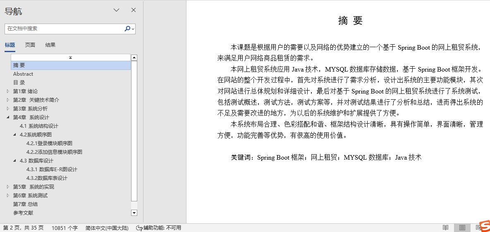
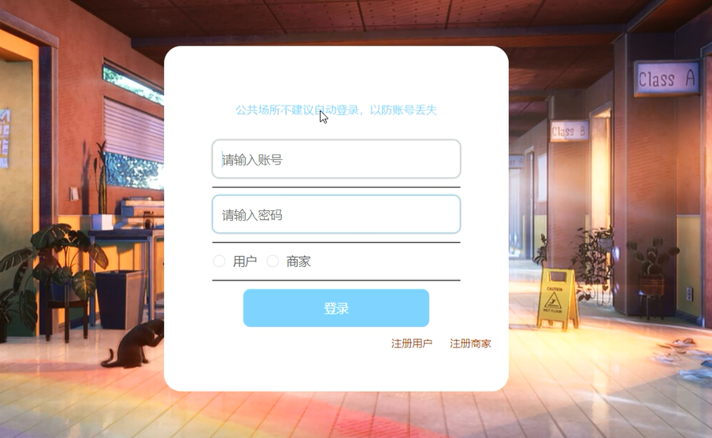
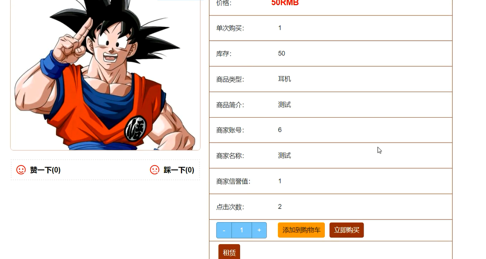
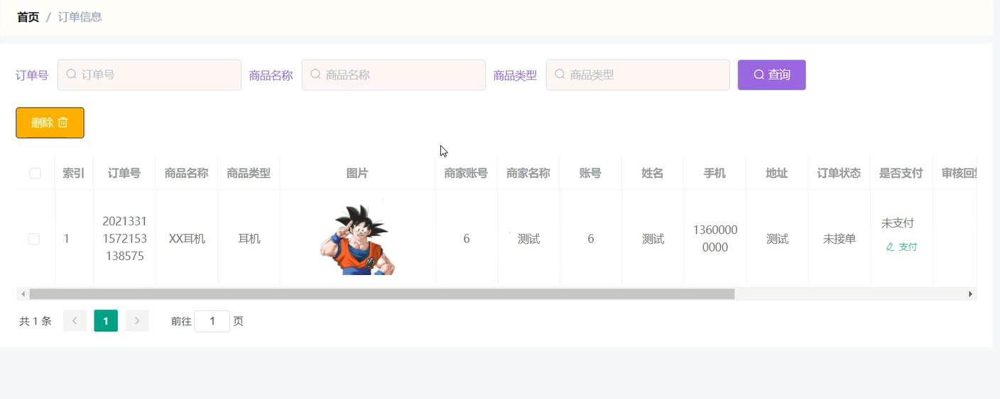
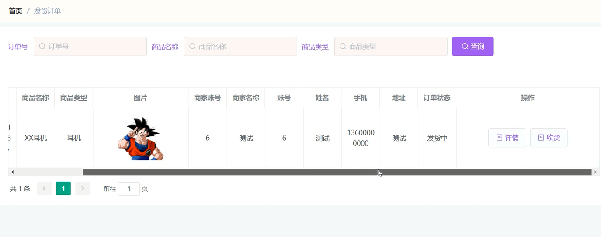
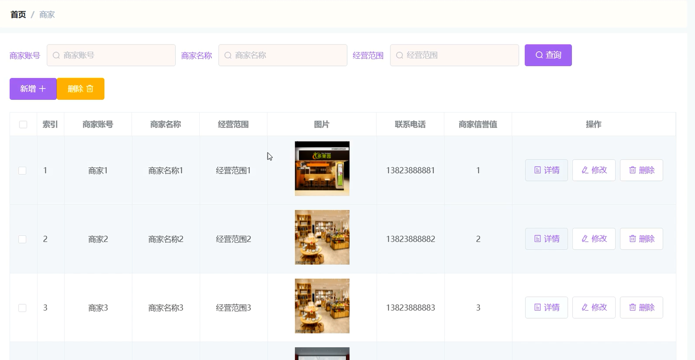
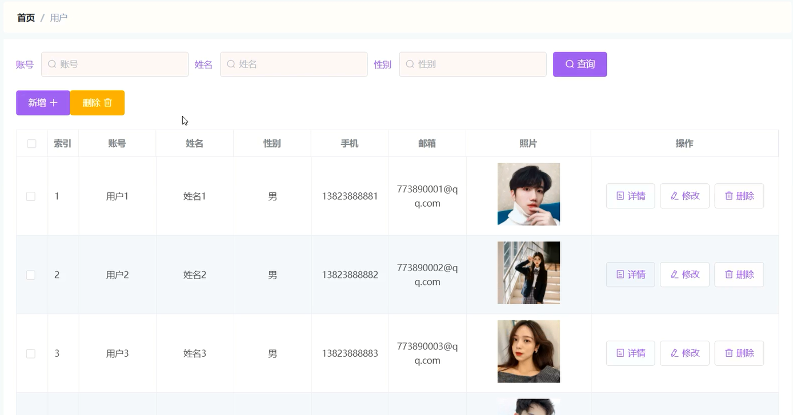
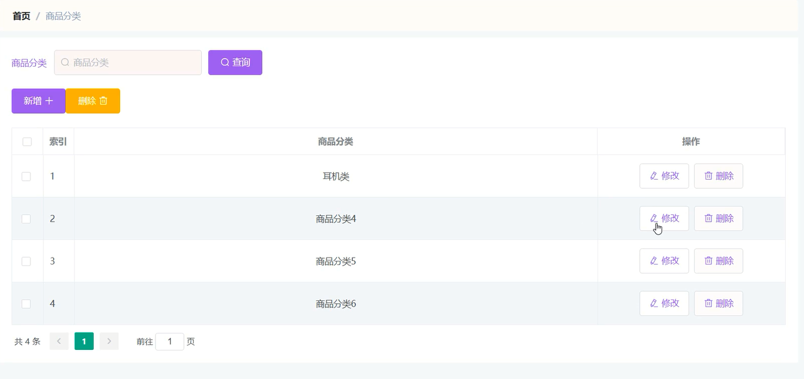
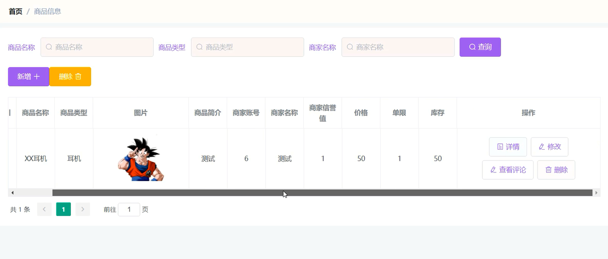
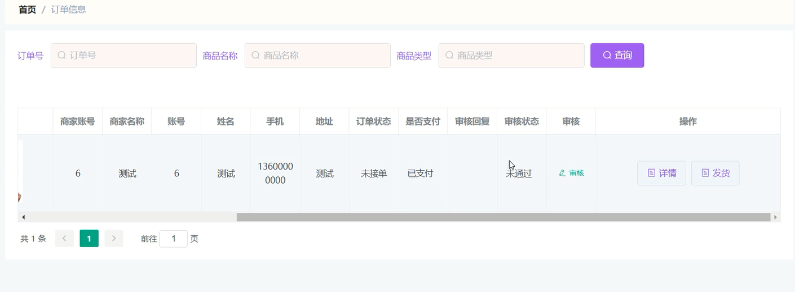

## 基于SpringBoot的网上租赁系统(程序+报告)

###  获取sql数据库文件: 从戎源码网 (https://armycodes.com/) QQ: 386869957 QQ群: 377586148
###  所有系统地址: (https://github.com/YuLin-Coder/AllProjectCatalog) 
###  所有项目以及源代码本人均调试运行无问题 可支持远程安装部署调试、定制修改、代码讲解

## 项目介绍
基于SpringBoot的网上租赁系统，系统包含两种角色：用户、管理员，系统分为前台和后台两大模块，主要功能如下：

### 【管理员】:
管理员登录界面
管理员通过输入正确的账号和密码登录系统后台进行管理操作。

商家管理界面
管理员可增删改查商家信息，维护平台上的商家数据。

用户管理界面
管理员可查看、修改和删除用户信息，并可新增用户，管理用户账户和权限。

商品分类管理界面
管理员可增删改查商品分类信息，维护商品分类的准确性和完整性。

### 【商家】:
商品信息管理界面
商家可在后台添加、修改和删除商品信息，确保商品信息的及时更新和准确。

订单信息管理界面
商家可查看订单信息，并对订单进行审核和发货操作，确保订单的及时处理和发货。

### 【用户】:
用户注册界面
没有账号的用户可进入注册界面进行注册操作，填写相关信息进行注册。

用户登录界面
用户在登录界面输入正确的用户名和密码，选择登录类型进行登录，成功后即可实现商品购买、租赁等操作。

个人信息界面
用户登录后可进入个人信息界面，对个人信息进行修改和更新。

商品详情界面
用户可选择商品查看详细信息，登录后可进行加入购物车、租赁和购买操作。

购物车界面
用户在购物车界面可查看已添加的商品信息，并进行修改数量、删除商品以及购买等操作。

订单信息界面
用户在订单信息界面可查看个人订单的详细信息，包括订单状态和物流信息。

发货订单界面
用户可查看个人发货订单信息，并在收到商品后进行收货确认操作。

## 项目技术
- 编程语言：Java
- 数据库：MySQL
- 项目管理工具：Maven
- 前端技术：HTML、CSS、JavaScript、Jquery、Vue
- 后端技术：Spring、SpringMVC、MyBatis

## 运行环境
- JDK版本：JDK1.8及以上
- 开发工具：IDEA、Ecplise、Myecplise都可以
- 数据库: MySQL5.7及以上
- Maven：maven3.0及以上
- Node：14.14.0及以上

## 运行截图

